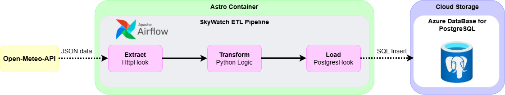

# 🚀 SkyWatch ETL: Weather Data Pipeline with Airflow & Azure

A functional ETL pipeline designed to automate weather data collection for Cuenca, Ecuador, using Apache Airflow and Azure PostgreSQL.

## 📊 Project Scope
This project automates the lifecycle of weather metrics. It was built to demonstrate how to bridge a public API with a cloud-based storage solution using professional orchestration tools.

### What this pipeline actually does:
1.  **Extraction:** Connects to the **Open-Meteo API** to retrieve current weather data for specific coordinates (-2.9002, -79.0100).
2.  **Transformation:** Processes the raw JSON response to extract temperature and wind metrics, and calculates an `alert_flag` if wind speeds exceed 15 km/h.
3.  **Loading:** Ensures data persistence by creating and inserting records into a **PostgreSQL** table (`weather_logs`), specifically configured to run on **Azure Database for PostgreSQL**.

## 🛠️ Technical Implementation
* **Orchestrator:** Apache Airflow (running on Astro CLI / Docker).
* **Data Source:** REST API (Open-Meteo).
* **Database:** PostgreSQL 13 (Development: Docker / Production: Azure).
* **Key Python Libraries:** `airflow-providers-http`, `airflow-providers-postgres`.

## ⚙️ Infrastructure Details
The project utilizes a dual-layered infrastructure:
* **Local Development:** A `docker-compose.yml` file manages a local PostgreSQL instance for rapid testing.
* **Cloud Persistence:** The `PostgresHook` is configured via Airflow Connections to point to an Azure Flexible Server, ensuring data survives even if the local containers are destroyed.

## 🚀 How to Run
1. Initialize with Astro: `astro dev start`
2. Configure **Connections** in the Airflow UI:
   - `open_meteo_api`: HTTP connection to `https://api.open-meteo.com`
   - `postgres_default`: PostgreSQL connection to your Azure instance.
3. Trigger the DAG: `skywatch_weather_intelligence`
